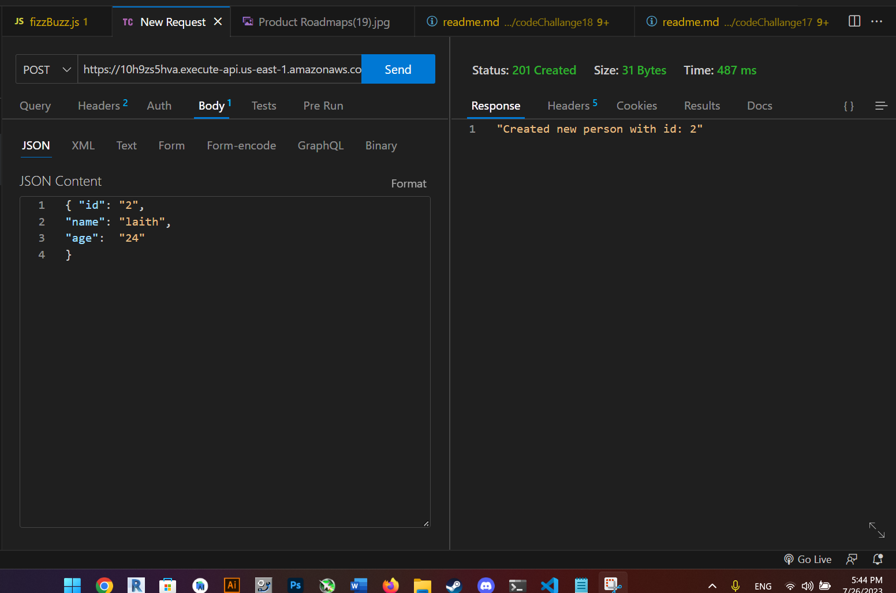

# serverless-api
## [PR](https://github.com/Laith-Vlad/serverless-api/pull/1)
## [deployed link](https://10h9zs5hva.execute-api.us-east-1.amazonaws.com)

## UML digram

## Project Description

this project uses aws gateway to create a serverless api so that you can add people    romvoe people and update people and scan for people 
## Deployment proof
get

post

update

delete

 ## doc
  
    What is the root URL to your API?
    https://10h9zs5hva.execute-api.us-east-1.amazonaws.com
    What are the routes?
    get:people
    post:people
    delete:people/id
    update:people/id
    What inputs do they require?
    id 
    name 
    age

    What output do they return?
    id 
    name 
    age

